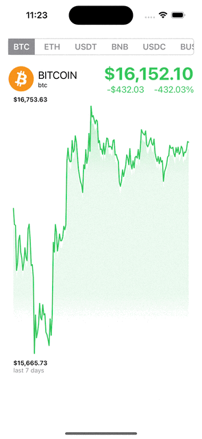

# Crypto_App
---
> 從網路上讀取7日漲跌幅與價格變動
> 再透過動態轉場將折線圖繪製出來

> API Link:[https://api.coingecko.com/api/v3/coin...](https://api.coingecko.com/api/v3/coins/markets?vs_currency=usd&order=market_cap_desc&per_page=10&sparkline=true&price_change_percentage=24h)
---
## 資料轉換
  將的[Double]轉換為[CGPoint]
  * 找出資料中最大與最小值
  * 利用path物件，將[CGPoint]中的點依次畫出來

## 把所有的東西包在geometryReader
  * 利用geometryProxy取得畫面長寬
  * geometryReader寬度是expanding(延伸到最大)，高度是neutral(根據容器內的view)

## 利用ZStack畫線與背景
### 線
  遍歷資料點，利用path畫線
  * strokePath描線
  * fill可以把線畫上漸層

### 背景
  在線的下方畫下背景色塊，可以使用漸層
  * linearGradient畫背景
  * 對漸層套用clipShape放入path (補上右、下線段將path封閉)

## 製作drag indicator
  * 用overlay疊加在zstack
  * 將Text、Rectangle、Circle用VStack由上到下排列
  * 利用contentShape定義感應區
## 套用dragGesture
  * 在手勢的開始與結束利用state控制indicator是否顯示
    ** 在withAnimation中修改狀態變數
    ** 注意，這邊不要用if，用opacity控制顯示與否，避免動畫錯亂
    ** 為了計算位置，將indicator設定固定的長寬
  * 這邊為了讓indicator隨著拖曳 ++黏到(snap)++ 線段上，必須根據拖曳的位移，計算要黏到哪一個資料點上
    ** 將(translation.value.x/點到點的寬度).round()就可以得到最接近資料點的index
    ** 但因為拖曳的時候可能會超出範圍，所以要注意不可以小於0，或是大於資料陣列的個數
  * 要注意算出的offset，如果會讓indicator上的文字超出畫面(通常是手指拖曳到畫面的最左或最右)，要把offset移回一點

## 標註文字
  * 在geometryReader上套用overlay或是在zstack新增一個vstack
  * 標註最大值、spacer、最小值
  
## 建立SegmentedTab
  * 將標籤放在ScrollView中
    ** 標籤選單的外框放在background，利用stroke描出外框線
    ** 按鈕放在HStack，利用ForEach讀出每筆資料，建立對應的按鈕
       而按鈕背景，可以在background中，基於顯示與否(透過onTapGesture切換)，透過matchedGeometryEffect製作出動態位移的轉場
  * matchedGeometryEffect，一般透過狀態變數與if搭配，在不同的狀態下，同一組view中(id相同)，一個view對應一個特定的狀態，狀態切換時會自動產生轉換動畫
  * 要注意一般的容器(HStack, VStack...)是基於內部元件的尺寸來決定自己的尺寸，但可以透過frame指定固定大小，或是佔用最大寬度/高度
  * 容器內元件的對齊，可以透過
    1. 透過容器的建構子，如VStack(alignment:)，但垂直擺放的容器，這裡只能指定水平對齊方式；水平擺放的容器，則是只能指定垂直對齊方式
    2. 透過frame(alignment:)，垂直容器，可以指定元件由top, center, bottom開始擺放；水平容器，可以指定元件由leading, center, trailing開始擺放
    3. 利用Spacer()，直接佔用剩餘的尺寸，將其餘的元件擠到邊邊

## 讀取網路資料
  * 建立DataModel
    ** 透過 keyDecodingStrategy = .convertFromSnakeCase，將資料中key的映射，從 a_b 轉換為 aB
    ** 要透過 enum CodingKeys，將json object key轉換成自訂型別的屬性名稱
    ** 提供一組sample資料(靜態變數)，方便離線測試
  * 宣告HttpDataLoader協定，提供一個load方法，回傳data型別的資料
    ** load方法是async throws，因為會從網路抓取資料，且json轉換過程可能會丟出錯誤
    ** extension URLSession，並實作HttpDataLoader協定，在load裡面使用內建的data方法抓取資料
        檢查回傳的狀態碼是否有包含在200...299
    ** 實作TestDownloader，讀取本機上的json檔來模擬從遠端下載資料，方便離線測試
        使用Task.sleep()模擬載入的時間差
        分為三個步驟，取得json檔案對應的url(Bundle.main.url)，透過url讀取json檔案，轉換json data為自訂型別
  * 建立一個load方法，接收字串檔名，讀取json檔案，最後回傳自訂型別；可以作為資料型別的sample資料，方便離線測試
  * 建立DataProvider，實作ObservableObject，將資料曝露出來給View訂閱
    ** 提供一個fetch方法，可以接收不同的loader參數，將 __讀取遠端或是本機資料__ 透過loader注射進去，方便在preview中看到測試結果

## 增加線段動畫
  * 因為path無法套用動畫，所以要新增一個struct shape，然後自訂path
  * 實作animatable參數，對應一個進度值，在withAnimation中操作這個進度值，來產生動畫
  * path的繪製可以用trimmerPath來控制；shape則是用trim
  